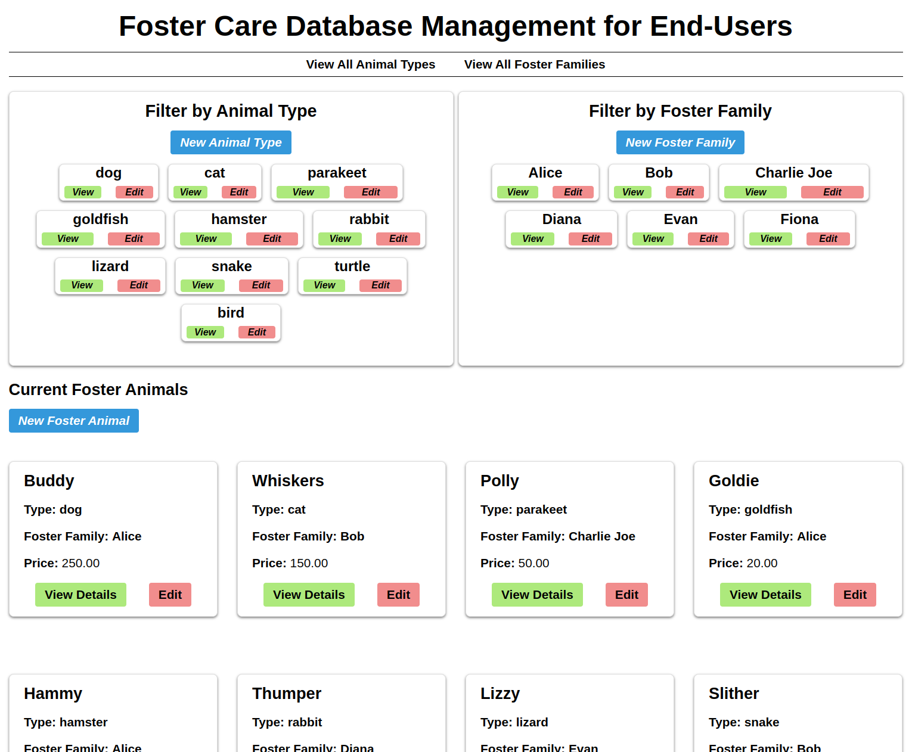

# Inventory Management App

A robust Express and PostgreSQL-based Inventory Management Application that allows end-users to manage inventory (animals) for an foster animal system. The app provides full CRUD functionality for categories, items, and foster families, complete with input validation using express-validator and custom SQL queries. Destructive actions are protected by requiring an admin password before changes are made. The app is deployed on Railway, demonstrating skills in backend development, database management, and deployment.

---

## Table of Contents

-   [Features](#features)
-   [Live Demo](#live-demo)
-   [Technologies Used](#technologies-used)
-   [Usage](#usage)
-   [Future Improvements](#future-improvements)
-   [Contributing](#contributing)
-   [License](#license)

---

## Features

-   **Category and Item Management:** Perform full CRUD operations on foster families, animal categories, and animals.
-   **Input Validation:** Uses `express-validator` to ensure data integrity and prevent invalid input.
-   **Error States:** Errors are handled gracefully with feedback on forms and next() with a final error handler for the app.
-   **Async/Await:** Asynchronous JS is used for controllers and db queries along with one-stop-shop error handling.
-   **Custom SQL Queries:** Leverages SQL-template-strings for safe and flexible database operations with PostgreSQL.
-   **Admin Protection:** Destructive actions (updates and deletes) require a secret admin password, adding an extra layer of protection.
-   **Filtering and Navigation:** Users can filter inventory by animal type or foster family, view detailed lists of items, and navigate easily between views.
-   **Deployment on Railway:** The app is deployed on Railway, utilizing private networking for secure, cost-effective database connectivity.

---

## Live Demo

Check out the live demo: [Live Inventory App](https://inventory-application-production-8a5f.up.railway.app/)

---

## Technologies Used

-   **Node.js & Express:** For building the server and API endpoints.
-   **PostgreSQL:** Database engine for inventory data.
-   **express-validator:** For input validation and sanitization.
-   **SQL-template-strings:** To construct safe SQL queries.
-   **Railway:** Deployment platform with private networking support.
-   **EJS:** Embedded JS for dynamic HTML.
-   **Dotenv:** For utilizing environment variables easily.
-   **CSS:** Basic styling for a clean, responsive user interface.

---

## Usage

-   **Home Page:** View a list of animals and filter by animal type or foster family.
-   **Category Management:** Create, update, and delete animal categories. Destructive actions require an admin password.
-   **Animal Management:** Add, update, or remove items within a category.
-   **Foster Family Management:** Add, update, or remove foster families.
-   **Thoughtful Deletion:** Animal types and foster families cannot be deleted unless all the animals that apply to them are removed.
-   **Admin Password:** To prevent accidental modifications, updating or deleting requires entry of a secret admin password (set via environment variables).

---

## Future Improvements

-   **Enhanced Authentication:** Implement a full authentication system with role-based access control.
-   **UI/UX Enhancements:** Improve the design and responsiveness of the front end.
-   **Bulk Operations:** Add features to update or delete multiple items at once.
-   **Advanced Filtering and Sorting:** Enable more robust search, filtering, and sorting capabilities.
-   **API Documentation:** Provide comprehensive API documentation for easier integration.

---

## Contributing

Contributions, issues, and feature requests are welcome! To contribute:

1. Fork the repository.
2. Create a feature branch: `git checkout -b feature/your-feature`.
3. Commit your changes: `git commit -m 'Add a cool feature'`.
4. Push the branch: `git push origin feature/your-feature`.
5. Open a Pull Request.

---

## License

This project is licensed under the [MIT License](/LICENSE). Feel free to use, modify, and distribute the project as you see fit.
